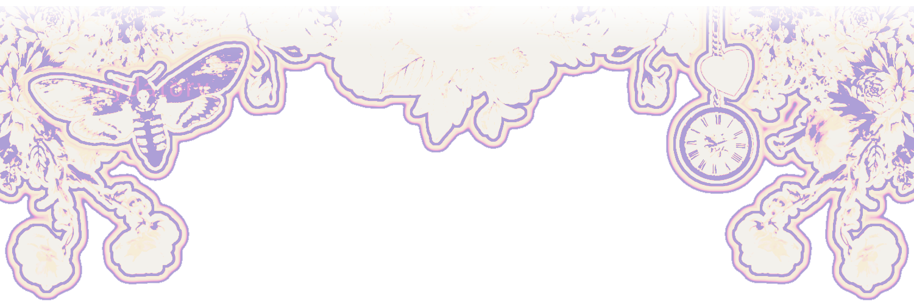
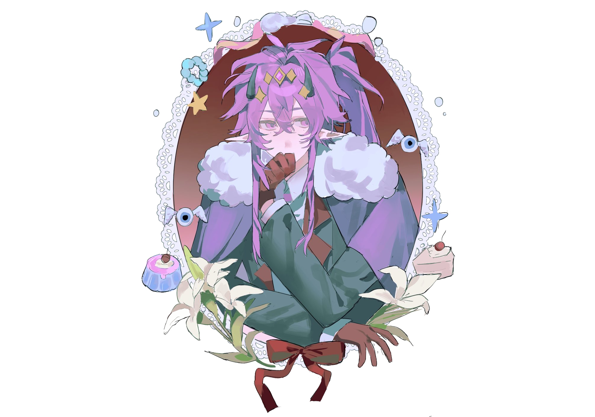
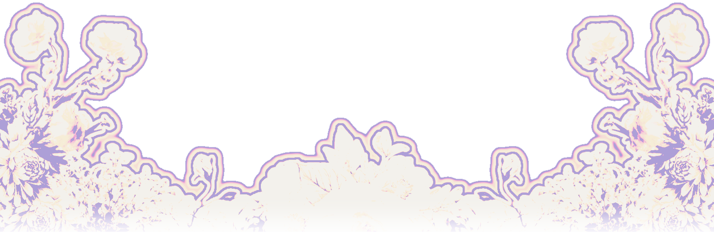

  

  
  
 

  

  $${\color{#FED9C3}mainly}$$ $${\color{#FAC1C1}afk}$$ $${\color{#d996c3}so}$$ $${\color{#bd7fb8}whis}$$ $${\color{#a570af}me}$$ $${\color{#7e62a1}if}$$ $${\color{#735a95}you}$$ $${\color{#464672}need}$$ $${\color{#393965}smth}$$ ㅤ 

  $${\color{#FED9C3}feel}$$ $${\color{#FED9C3}free}$$ $${\color{#FAC1c1}to}$$ $${\color{#FAC1c1}c*h}$$ $${\color{#d996c3}w}$$ $${\color{#d996c3}me}$$ $${\color{#bd7fb8}even}$$ $${\color{#bd7fb8}if}$$ $${\color{#a570af}it's}$$ $${\color{#a570af}not}$$ $${\color{#7e62a1}in}$$ $${\color{#7e62a1}my}$$ $${\color{#735a95}name}$$ $${\color{#735a95}but}$$ $${\color{#464672}if}$$ $${\color{#464672}im}$$ $${\color{#393965}w}$$ $${\color{#393965}my}$$ $${\color{#464672}friends}$$ $${\color{#464672}please}$$ $${\color{#735a95}check}$$ $${\color{#735a95}their}$$ $${\color{#7e62a1}dni/status}$$ ㅤ 

  $${\color{#FED9C3}AC}$$ $${\color{#FDCDC7}to}$$ $${\color{#FAC1C1}@n3gr0ni}$$ $${\color{#d996c3}on}$$ $${\color{#bd7fb8}X}$$ ㅤ 

  

